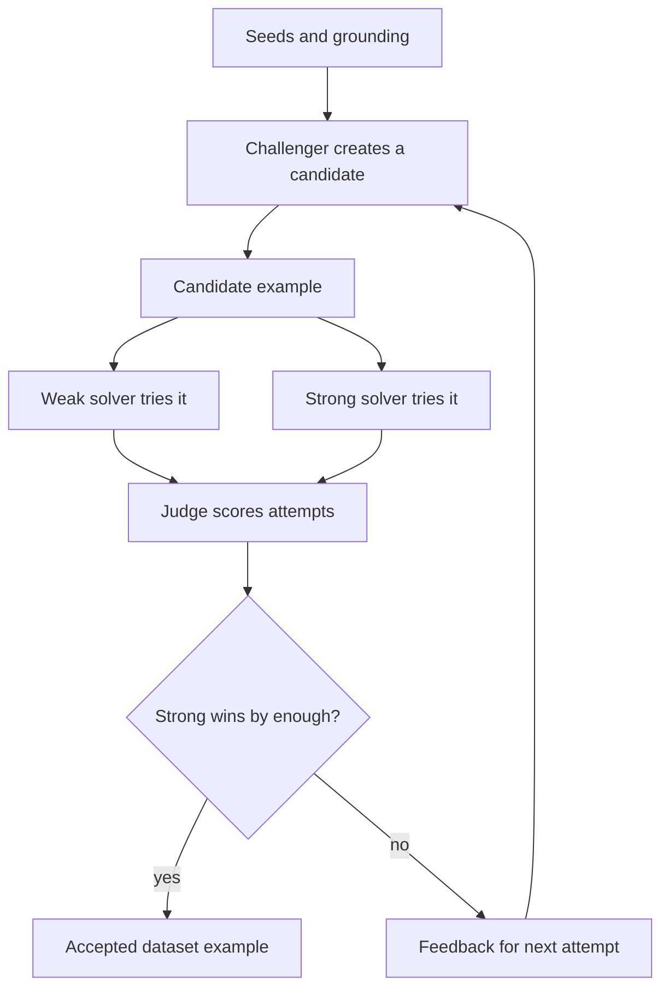
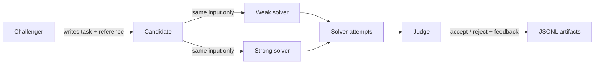

# DataSmith

Turn seeds, production traces, and domain documents into useful synthetic training and evaluation
data.

DataSmith is a provider-agnostic Python SDK and CLI inspired by Meta FAIR's Autodata paper. The
current package name is `agentic-self-instruct`, and the Python import is `asi`, but the public
project name is intentionally simpler: DataSmith makes better model data by testing each generated
example against weak and strong solvers before accepting it.

## Autodata In Plain English

Autodata treats data creation like a feedback loop instead of a one-shot prompt. A challenger model
creates a candidate example from your seeds. A weaker model tries to solve it. A stronger model tries
the same task. A judge checks whether the strong model wins by enough and whether the example is
high quality. If the answer is no, the judge feedback goes back to the challenger and the system
tries again. If the answer is yes, the candidate becomes a dataset example.

That loop is useful because bad synthetic data is usually either too easy, too hard, or detached from
real product failures. DataSmith keeps the useful middle: examples that expose what the target model
currently misses while still being solvable by a stronger model or stronger reasoning path.



## What DataSmith Does

DataSmith packages the Agentic Self-Instruct pressure test into a small developer tool:

1. A challenger model proposes one candidate example from seeds and prior judge feedback.
2. A weak solver attempts the example.
3. A strong solver attempts the same example.
4. A judge scores quality and weak/strong separation.
5. Accepted examples are written as JSONL artifacts. Rejected examples preserve the reason, solver
   attempts, and judge feedback so the next challenger round can improve.

The goal is not "harder data" in the abstract. The goal is data that is useful for the target model:
not trivial, not impossible, and grounded in the failure modes you actually care about.



The roles are intentionally simple:

- `challenger`: generates candidate examples from seeds and previous feedback
- `weak_solver`: represents the model, prompt, or low-compute path you want to improve
- `strong_solver`: represents a stronger model, better prompt, more rollouts, or expert path
- `judge`: checks quality and whether the strong solver clearly outperforms the weak one

## Why This Exists

The Autodata paper reports that Agentic Self-Instruct can produce better data than standard
prompt-only synthetic generation across several settings:

- CS research QA: the loop widened the weak/strong score gap from 0.019 to 0.314 and improved
  downstream RL training on held-out tasks.
- Legal reasoning: the loop fixed the opposite failure mode, where prompt-only data was too hard to
  learn from, by shaping examples into a more useful reward distribution.
- Scientific reasoning: agentic data delivered stronger average gains than larger combined datasets,
  showing that data quality can beat raw data volume.

DataSmith brings that pattern to developers as a small, inspectable library:

- no required provider SDKs
- no API keys needed for tests or the local demo
- pluggable model objects for challenger, solvers, and judge
- OpenTelemetry and span JSONL ingestion for trace-derived seeds
- typed accepted/rejected artifacts suitable for evals, fine-tuning, RL, or human review

## Install

```bash
pip install agentic-self-instruct
```

For local development:

```bash
git clone https://github.com/Atharva-Kanherkar/agentic-self-instruct
cd agentic-self-instruct
python3.12 -m venv .venv
source .venv/bin/activate
python -m pip install -e ".[dev]"
python -m pytest
python -m ruff check .
```

## Quickstart

Run the deterministic demo with no API keys:

```bash
asi run --seeds examples/seeds.jsonl --output-dir runs/demo --target-count 2 --local-demo
```

Convert OTLP JSON traces to seed examples:

```bash
asi ingest-otel examples/otel-traces.json --output runs/otel-seeds.jsonl
```

Use the SDK directly:

```python
from asi import AgenticSelfInstruct, DeterministicChallenger, DeterministicJudge, DeterministicSolver
from asi.io import read_jsonl

runner = AgenticSelfInstruct(
    challenger=DeterministicChallenger(),
    weak_solver=DeterministicSolver("weak"),
    strong_solver=DeterministicSolver("strong"),
    judge=DeterministicJudge(),
)

result = runner.run(read_jsonl("examples/seeds.jsonl"), target_count=2)
print(result.summary())
```

The run writes three artifacts:

- `accepted.jsonl`: examples that passed the policy
- `rejected.jsonl`: failed candidates with solver attempts, judge output, and reason codes
- `summary.json`: accepted count, rejected count, attempts, score gaps, and feedback

## Bring Your Own Models

Any object with this method can act as a challenger, solver, or judge:

```python
class MyModel:
    def complete(self, prompt: str, *, role: str, metadata: dict) -> str:
        ...
```

Use separate implementations for the challenger, weak solver, strong solver, and judge. The included
`OpenAICompatibleModel` is optional and dependency-free:

```python
from asi.providers import OpenAICompatibleModel

model = OpenAICompatibleModel(
    model="gpt-4.1-mini",
    base_url="https://api.openai.com/v1",
)
```

Provider adapters should return plain text. The challenger and judge are expected to return strict
JSON matching the prompts in `src/asi/prompts.py`.

## Real Use Cases

Use this when you already have seeds, traces, or source documents and need examples that expose a
model's current weaknesses.

### Legal Reasoning

Use legal documents, policy snippets, or compliance memos as seeds. The accepted examples should be
answerable by a strong legal-reasoning path while exposing where the weak solver misses holdings,
exceptions, or fact application.

```json
{"input":{"task":"Apply the refund clause to a disputed subscription cancellation.","context":"Policy: customers can receive a refund within 14 days unless the account consumed more than 80% of included credits. Facts: the customer canceled on day 10 after consuming 92% of credits.","question":"Should the support agent offer a refund, and what condition controls the answer?"},"expected":{"answer":"No automatic refund. The cancellation is within 14 days, but the 80% credit-consumption exception controls because the account used 92% of credits."},"metadata":{"domain":"legal-policy","source":"example","tags":["refunds","exceptions","fact-application"]}}
```

```bash
mkdir -p runs/legal
printf '%s\n' '{"input":{"task":"Apply the refund clause to a disputed subscription cancellation.","context":"Policy: customers can receive a refund within 14 days unless the account consumed more than 80% of included credits. Facts: the customer canceled on day 10 after consuming 92% of credits.","question":"Should the support agent offer a refund, and what condition controls the answer?"},"expected":{"answer":"No automatic refund. The cancellation is within 14 days, but the 80% credit-consumption exception controls because the account used 92% of credits."},"metadata":{"domain":"legal-policy","source":"example","tags":["refunds","exceptions","fact-application"]}}' > runs/legal/seeds.jsonl
asi run --seeds runs/legal/seeds.jsonl --output-dir runs/legal/out --target-count 1 --local-demo
```

### Production Agent Regression Suites

Use failed support traces, tool-call transcripts, or manually reviewed incidents as seeds. This turns
real production mistakes into new eval cases before the next prompt or model ships.

```json
{"input":{"task":"Diagnose the agent's tool-use failure before answering the customer.","context":"Trace: the agent answered from cached account_state from 09:00. A fresh billing_event at 09:05 changed the subscription status to canceled. The final answer promised continued access.","question":"What should the agent have done before answering?"},"expected":{"answer":"Refresh account state or read the latest billing event before making an access promise; the cached state was stale."},"metadata":{"domain":"support-agent","source":"redacted-trace","tags":["tool-use","stale-cache","billing"]}}
```

If you already have OpenTelemetry spans, convert them first:

```bash
asi ingest-otel examples/spans.jsonl --format jsonl --output runs/trace-seeds.jsonl
asi run --seeds runs/trace-seeds.jsonl --output-dir runs/trace-evals --target-count 2 --local-demo
```

### Coding And Tool-Use Assistants

Use examples where the obvious answer is incomplete unless the model follows a constraint, calls the
right tool, or checks a result.

```json
{"input":{"task":"Review a migration plan for a billing table.","context":"The plan adds a NOT NULL column `billing_country` to `invoices` without a default or backfill. Existing rows do not have this value.","question":"What is the migration risk and safer rollout?"},"expected":{"answer":"The migration can fail or lock because existing rows violate NOT NULL. Add the nullable column, backfill values, validate, then add the NOT NULL constraint in a later step."},"metadata":{"domain":"coding","source":"example","tags":["database","migration","backfill"]}}
```

### Custom SDK Use

Replace the deterministic demo models with your own challenger, weak solver, strong solver, and
judge. The CLI is intentionally demo-only today; use the SDK when wiring real providers.

```python
from asi import AgenticSelfInstruct, Example
from asi.providers import OpenAICompatibleModel

challenger = OpenAICompatibleModel(model="gpt-4.1-mini")
weak_solver = OpenAICompatibleModel(model="gpt-4.1-mini", temperature=0.2)
strong_solver = OpenAICompatibleModel(model="gpt-4.1")
judge = OpenAICompatibleModel(model="gpt-4.1")

runner = AgenticSelfInstruct(
    challenger=challenger,
    weak_solver=weak_solver,
    strong_solver=strong_solver,
    judge=judge,
    weak_rollouts=3,
    strong_rollouts=3,
)

result = runner.run(
    [
        Example(
            input={
                "task": "Apply the refund clause to a disputed subscription cancellation.",
                "context": "Refunds are allowed within 14 days unless usage exceeds 80%.",
            }
        )
    ],
    target_count=5,
)

print(result.summary())
```

## OpenTelemetry Input

The package supports OTLP JSON exports and flattened span JSONL. It preserves:

- `trace_id`, `span_id`, span name, resource attributes, and scope attributes
- GenAI/OpenInference-style prompt and completion attributes
- all original span attributes in example metadata

Preferred prompt attributes include `gen_ai.prompt`, `gen_ai.input.messages`, `llm.prompt`,
`openinference.input.value`, `input.value`, and `prompt`. Completion attributes follow the same
pattern with output/completion names.

See [docs/otel.md](docs/otel.md).

## Scope And Gaps

This is a practical OSS substrate, not a paper reproduction.

Implemented:

- provider-agnostic model protocol
- deterministic local demo models
- weak/strong solver rollouts
- judge-driven acceptance policy
- accepted/rejected JSONL artifacts
- OTLP JSON and span JSONL ingestion
- CLI for local demo runs and trace ingestion
- tests for IO, CLI, ingestion, prompt leakage, and judge-output validation

Not implemented yet:

- full Autodata outer-loop meta-optimization
- provider config files for the CLI
- built-in human review queues
- training/RL orchestration
- dataset-level diversity optimization
- PII redaction for production traces
- hosted observability integrations

## Research References

- Meta FAIR, [Autodata: An agentic data scientist to create high quality synthetic data](https://arxiv.org/abs/2606.25996)
- Microsoft Research, [AgentInstruct: Toward Generative Teaching with Agentic Flows](https://arxiv.org/abs/2407.03502)
- Braintrust, [Agent observability: the complete guide for 2026](https://www.braintrust.dev/articles/agent-observability-complete-guide-2026)
- Grafana Labs, [Observing agentic AI workflows with Grafana Cloud, OpenTelemetry, and the OpenAI Agents SDK](https://grafana.com/blog/observing-agentic-ai-workflows-with-grafana-cloud-opentelemetry-and-the-openai-agents-sdk/)

## Status

Alpha. The public API is intentionally small and typed. Expect iteration as the Autodata and agent
observability ecosystems mature.

## License

MIT.
