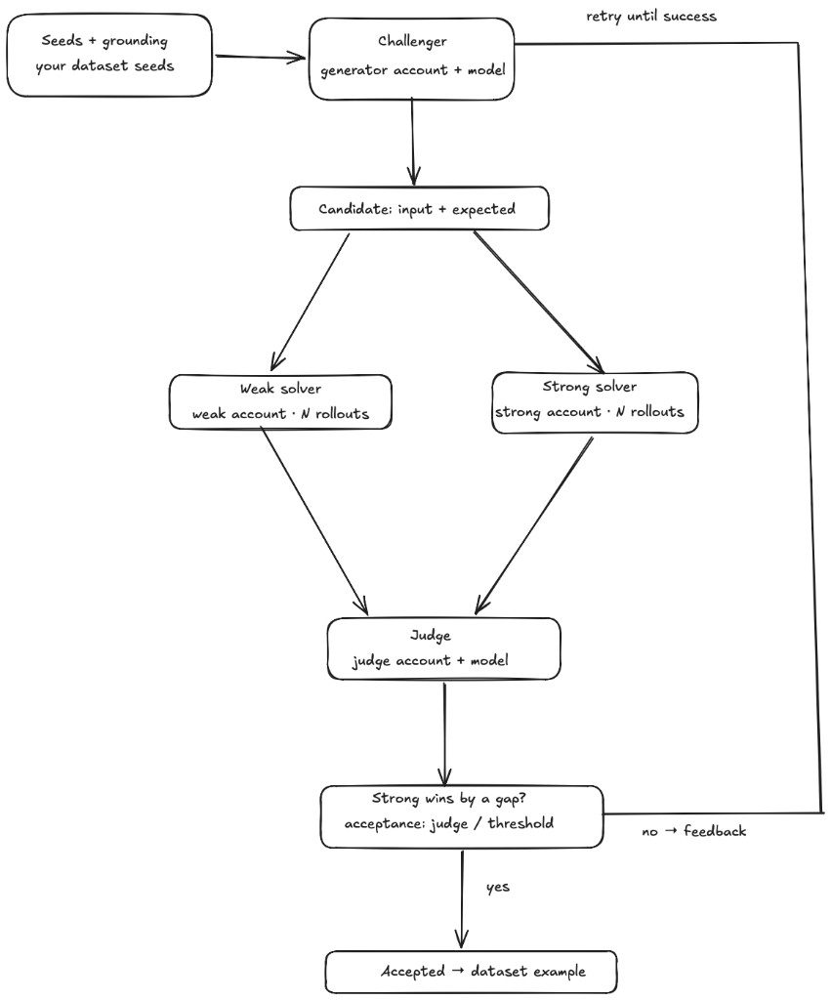

# DataSmith

Turn seeds, production traces, and domain documents into useful synthetic training and evaluation
data.

DataSmith is a provider-agnostic Python SDK and CLI inspired by Meta FAIR's Autodata paper. The
current package name is `agentic-self-instruct`, and the Python import is `asi`, but the public
project name is intentionally simpler: DataSmith makes better model data by testing each generated
example against weak and strong solvers before accepting it.



## Autodata In Plain English

Autodata treats data creation like a feedback loop instead of a one-shot prompt. A challenger model
creates a candidate example from your seeds. A weaker model tries to solve it. A stronger model tries
the same task. A judge checks whether the strong model wins by enough and whether the example is
high quality. If the answer is no, the judge feedback goes back to the challenger and the system
tries again. If the answer is yes, the candidate becomes a dataset example.

That loop is useful because bad synthetic data is usually either too easy, too hard, or detached from
real product failures. DataSmith keeps the useful middle: examples that expose what the target model
currently misses while still being solvable by a stronger model or stronger reasoning path.

## What DataSmith Does

DataSmith packages the Agentic Self-Instruct pressure test into a small developer tool:

1. A challenger model proposes one candidate example from seeds and prior judge feedback.
2. A weak solver attempts the example.
3. A strong solver attempts the same example.
4. A judge scores quality and weak/strong separation.
5. Accepted examples are written as JSONL artifacts. Rejected examples preserve the reason, solver
   attempts, and judge feedback so the next challenger round can improve.

The goal is not "harder data" in the abstract. The goal is data that is useful for the target model:
not trivial, not impossible, and grounded in the failure modes you actually care about.

## Why This Exists

The Autodata paper reports that Agentic Self-Instruct can produce better data than standard
prompt-only synthetic generation across several settings:

- CS research QA: the loop widened the weak/strong score gap from 0.019 to 0.314 and improved
  downstream RL training on held-out tasks.
- Legal reasoning: the loop fixed the opposite failure mode, where prompt-only data was too hard to
  learn from, by shaping examples into a more useful reward distribution.
- Scientific reasoning: agentic data delivered stronger average gains than larger combined datasets,
  showing that data quality can beat raw data volume.

DataSmith brings that pattern to developers as a small, inspectable library:

- no required provider SDKs
- no API keys needed for tests or the local demo
- pluggable model objects for challenger, solvers, and judge
- OpenTelemetry and span JSONL ingestion for trace-derived seeds
- typed accepted/rejected artifacts suitable for evals, fine-tuning, RL, or human review

## Install

```bash
pip install agentic-self-instruct
```

For local development:

```bash
git clone https://github.com/Atharva-Kanherkar/agentic-self-instruct
cd agentic-self-instruct
python3.12 -m venv .venv
source .venv/bin/activate
python -m pip install -e ".[dev]"
python -m pytest
python -m ruff check .
```

## Quickstart

Run the deterministic demo with no API keys:

```bash
asi run --seeds examples/seeds.jsonl --output-dir runs/demo --target-count 2 --local-demo
```

Convert OTLP JSON traces to seed examples:

```bash
asi ingest-otel examples/otel-traces.json --output runs/otel-seeds.jsonl
```

Use the SDK directly:

```python
from asi import AgenticSelfInstruct, DeterministicChallenger, DeterministicJudge, DeterministicSolver
from asi.io import read_jsonl

runner = AgenticSelfInstruct(
    challenger=DeterministicChallenger(),
    weak_solver=DeterministicSolver("weak"),
    strong_solver=DeterministicSolver("strong"),
    judge=DeterministicJudge(),
)

result = runner.run(read_jsonl("examples/seeds.jsonl"), target_count=2)
print(result.summary())
```

The run writes three artifacts:

- `accepted.jsonl`: examples that passed the policy
- `rejected.jsonl`: failed candidates with solver attempts, judge output, and reason codes
- `summary.json`: accepted count, rejected count, attempts, score gaps, and feedback

## Bring Your Own Models

Any object with this method can act as a challenger, solver, or judge:

```python
class MyModel:
    def complete(self, prompt: str, *, role: str, metadata: dict) -> str:
        ...
```

Use separate implementations for the challenger, weak solver, strong solver, and judge. The included
`OpenAICompatibleModel` is optional and dependency-free:

```python
from asi.providers import OpenAICompatibleModel

model = OpenAICompatibleModel(
    model="gpt-4.1-mini",
    base_url="https://api.openai.com/v1",
)
```

Provider adapters should return plain text. The challenger and judge are expected to return strict
JSON matching the prompts in `src/asi/prompts.py`.

## Real Use Cases

Use this when you already have seeds, traces, or source documents and need examples that expose a
model's current weaknesses.

Production agent regression suites:
Teams now trace agent runs across LLM calls, tools, memory reads, state transitions, and handoffs.
Braintrust describes the practical loop as scoring production traces and feeding failures back into
the eval suite. DataSmith can ingest those spans as seeds, generate nearby hard cases, and export
JSONL for CI evals before a weaker model or prompt ships.

OpenTelemetry-to-eval pipelines:
Grafana's OpenAI Agents SDK walkthrough shows agent workflows exported through OpenTelemetry into
Grafana Cloud, including guardrail failures, handoffs, model metadata, and token usage. This package
uses the same trace-shaped inputs to turn observed production behavior into candidate training or
evaluation examples.

Customer support and policy QA:
Support agents often fail on edge policies, refunds, account state, and tool sequencing. Use real
redacted tickets or traces as seeds, a weaker deployed model as the weak solver, and a stronger model
or human-reviewed judge rubric as the strong path.

Legal, compliance, and domain reasoning:
Autodata's legal experiments show why "make it harder" is not always right. Some examples are too
hard to teach from. The weak/strong loop helps shape questions toward examples with useful learning
signal instead of accepting every large gap blindly.

Coding and tool-use assistants:
AgentInstruct and related synthetic-data work show that agentic flows can generate data for coding,
tool use, reading comprehension, and web control from raw documents or code. This repo is useful when
you want a smaller, auditable loop that keeps weak/strong disagreement and rejection artifacts visible.

## OpenTelemetry Input

The package supports OTLP JSON exports and flattened span JSONL. It preserves:

- `trace_id`, `span_id`, span name, resource attributes, and scope attributes
- GenAI/OpenInference-style prompt and completion attributes
- all original span attributes in example metadata

Preferred prompt attributes include `gen_ai.prompt`, `gen_ai.input.messages`, `llm.prompt`,
`openinference.input.value`, `input.value`, and `prompt`. Completion attributes follow the same
pattern with output/completion names.

See [docs/otel.md](docs/otel.md).

## Scope And Gaps

This is a practical OSS substrate, not a paper reproduction.

Implemented:

- provider-agnostic model protocol
- deterministic local demo models
- weak/strong solver rollouts
- judge-driven acceptance policy
- accepted/rejected JSONL artifacts
- OTLP JSON and span JSONL ingestion
- CLI for local demo runs and trace ingestion
- tests for IO, CLI, ingestion, prompt leakage, and judge-output validation

Not implemented yet:

- full Autodata outer-loop meta-optimization
- provider config files for the CLI
- built-in human review queues
- training/RL orchestration
- dataset-level diversity optimization
- PII redaction for production traces
- hosted observability integrations

## Research References

- Meta FAIR, [Autodata: An agentic data scientist to create high quality synthetic data](https://arxiv.org/abs/2606.25996)
- Microsoft Research, [AgentInstruct: Toward Generative Teaching with Agentic Flows](https://arxiv.org/abs/2407.03502)
- Braintrust, [Agent observability: the complete guide for 2026](https://www.braintrust.dev/articles/agent-observability-complete-guide-2026)
- Grafana Labs, [Observing agentic AI workflows with Grafana Cloud, OpenTelemetry, and the OpenAI Agents SDK](https://grafana.com/blog/observing-agentic-ai-workflows-with-grafana-cloud-opentelemetry-and-the-openai-agents-sdk/)

## Status

Alpha. The public API is intentionally small and typed. Expect iteration as the Autodata and agent
observability ecosystems mature.

## License

MIT.
