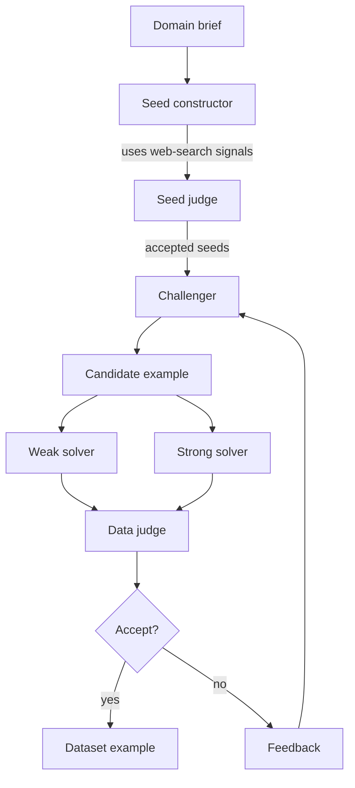
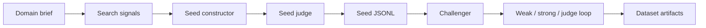

# DataSmith

DataSmith is a provider-agnostic Python SDK and CLI for building synthetic training and evaluation
datasets from domain briefs, web-grounded seed construction, production traces, and source
documents.

The library implements two stages: a seed-constructor agent that can use web-search signals to
bootstrap initial seed examples, then the practical weak-vs-strong data generation loop described in
Meta FAIR's Autodata work. The search capability is isolated to seed construction; the challenger,
solvers, and downstream judge operate only on the constructed seeds and provided artifacts.

The Python import remains `asi` for compatibility. The command-line entrypoint is available as both
`datasmith` and `asi`.

## Overview

Classic self-instruct pipelines assume you already have seed examples. DataSmith can now bootstrap
those seeds first, then run the weak-vs-strong validation loop.

This is useful for creating data that is not merely synthetic, but targeted: examples should be
grounded in your source material, difficult for the model you want to improve, and still solvable by
a stronger model, stronger prompt, higher-compute path, or expert reference.



## Core Concepts

DataSmith exposes one seed-construction stage and four data-generation roles.

- `seed_constructor`: uses domain briefs and web-search signals to create initial seed examples
- `seed_judge`: scores seed examples for grounding, specificity, and usefulness

- `challenger`: generates candidate examples from seeds and prior judge feedback
- `weak_solver`: represents the model, prompt, or low-compute path you want to improve
- `strong_solver`: represents a stronger model, prompt, rollout policy, or expert path
- `judge`: evaluates example quality and weak/strong separation



Accepted and rejected candidates are both preserved. Rejections include reason codes, solver
attempts, judge output, and feedback for later challenger attempts.

## Features

- Provider-agnostic model interface
- Web-grounded seed-construction primitive
- Deterministic local demo models for tests and tutorials
- Weak and strong solver rollouts
- Judge-driven acceptance policy
- Accepted and rejected JSONL artifacts
- OTLP JSON and flattened span JSONL ingestion
- CLI for local demo runs and trace ingestion
- Tests for IO, CLI, ingestion, prompt leakage, judge validation, and partial-run reporting

## Research Background

The Autodata paper reports that weak-vs-strong Agentic Self-Instruct can produce better data than
standard prompt-only synthetic generation across several settings:

- CS research QA: the loop widened the weak/strong score gap from 0.019 to 0.314 and improved
  downstream RL training on held-out tasks.
- Legal reasoning: the loop fixed the opposite failure mode, where prompt-only data was too hard to
  learn from, by shaping examples into a more useful reward distribution.
- Scientific reasoning: agentic data delivered stronger average gains than larger combined datasets,
  showing that data quality can beat raw data volume.

DataSmith is not an official Meta implementation and does not reproduce the paper's full training or
meta-optimization stack. It provides the reusable inner loop: ingestion, model interfaces,
orchestration, acceptance policies, artifacts, CLI, and tests.

## Install

```bash
pip install datasmith
```

For local development:

```bash
git clone https://github.com/Atharva-Kanherkar/datasmith
cd datasmith
python3.12 -m venv .venv
source .venv/bin/activate
python -m pip install -e ".[dev]"
python -m pytest
python -m ruff check .
```

## Quickstart

Construct initial seed examples from a domain brief:

```bash
datasmith construct-seeds \
  --domain "legal refund policy reasoning for subscription support" \
  --output-dir runs/legal-seeds \
  --target-count 3 \
  --local-demo
```

Run the deterministic demo with no API keys:

```bash
datasmith run --seeds runs/legal-seeds/seeds.jsonl --output-dir runs/demo --target-count 2 --local-demo
```

Convert OTLP JSON traces to seed examples:

```bash
datasmith ingest-otel examples/otel-traces.json --output runs/otel-seeds.jsonl
```

Use the SDK directly:

```python
from asi import AgenticSelfInstruct, DeterministicChallenger, DeterministicJudge, DeterministicSolver
from asi.io import read_jsonl

runner = AgenticSelfInstruct(
    challenger=DeterministicChallenger(),
    weak_solver=DeterministicSolver("weak"),
    strong_solver=DeterministicSolver("strong"),
    judge=DeterministicJudge(),
)

result = runner.run(read_jsonl("examples/seeds.jsonl"), target_count=2)
print(result.summary())
```

The run writes three artifacts:

- `accepted.jsonl`: examples that passed the policy
- `rejected.jsonl`: failed candidates with solver attempts, judge output, and reason codes
- `summary.json`: accepted count, rejected count, attempts, score gaps, and feedback

The seed-construction command writes:

- `seeds.jsonl`: accepted seed examples
- `rejected-seeds.jsonl`: rejected seeds and judge reasons
- `signals.json`: web-search signals used by the seed-constructor stage
- `summary.json`: accepted count, rejected count, attempts, target status, and signal count

## Bring Your Own Models

Any object with this method can act as a challenger, solver, or judge:

```python
class MyModel:
    def complete(self, prompt: str, *, role: str, metadata: dict) -> str:
        ...
```

Use separate implementations for the challenger, weak solver, strong solver, and judge. The included
`OpenAICompatibleModel` is optional and dependency-free:

```python
from asi.providers import OpenAICompatibleModel

model = OpenAICompatibleModel(
    model="gpt-4.1-mini",
    base_url="https://api.openai.com/v1",
)
```

Provider adapters should return plain text. The challenger and judge are expected to return strict
JSON matching the prompts in `src/asi/prompts.py`.

Seed construction uses the same model protocol plus a separate search client:

```python
from asi import SeedConstructor
from asi.providers import OpenAICompatibleModel

seed_builder = SeedConstructor(
    search_client=my_search_client,
    constructor=OpenAICompatibleModel(model="gpt-4.1-mini"),
    judge=OpenAICompatibleModel(model="gpt-4.1"),
)

seed_result = seed_builder.run(
    domain="legal refund policy reasoning for subscription support",
    target_count=10,
    queries=[
        "subscription refund policy exceptions SaaS support",
        "customer support refund escalation usage limits",
    ],
)
```

Only `search_client` receives web-search access. The challenger, weak solver, strong solver, and
data judge consume the resulting seeds and do not need search capability.

## Examples

The examples below create seed files that can be used with the deterministic local demo. In
production, replace the demo models with your own challenger, weak solver, strong solver, and judge
through the SDK.

### Legal Reasoning

Use legal documents, policy snippets, or compliance memos as seeds. The accepted examples should be
answerable by a strong legal-reasoning path while exposing where the weak solver misses holdings,
exceptions, or fact application.

```json
{
  "input": {
    "task": "Apply the refund clause to a disputed subscription cancellation.",
    "context": "Policy: customers can receive a refund within 14 days unless the account consumed more than 80% of included credits. Facts: the customer canceled on day 10 after consuming 92% of credits.",
    "question": "Should the support agent offer a refund, and what condition controls the answer?"
  },
  "expected": {
    "answer": "No automatic refund. The cancellation is within 14 days, but the 80% credit-consumption exception controls because the account used 92% of credits."
  },
  "metadata": {
    "domain": "legal-policy",
    "source": "example",
    "tags": ["refunds", "exceptions", "fact-application"]
  }
}
```

```bash
mkdir -p runs/legal
python - <<'PY'
import json
from pathlib import Path

Path("runs/legal").mkdir(parents=True, exist_ok=True)
seed = {
    "input": {
        "task": "Apply the refund clause to a disputed subscription cancellation.",
        "context": (
            "Policy: customers can receive a refund within 14 days unless the account consumed "
            "more than 80% of included credits. Facts: the customer canceled on day 10 after "
            "consuming 92% of credits."
        ),
        "question": "Should the support agent offer a refund, and what condition controls the answer?",
    },
    "expected": {
        "answer": (
            "No automatic refund. The cancellation is within 14 days, but the 80% "
            "credit-consumption exception controls because the account used 92% of credits."
        )
    },
    "metadata": {
        "domain": "legal-policy",
        "source": "example",
        "tags": ["refunds", "exceptions", "fact-application"],
    },
}
Path("runs/legal/seeds.jsonl").write_text(json.dumps(seed) + "\n", encoding="utf-8")
PY
datasmith run --seeds runs/legal/seeds.jsonl --output-dir runs/legal/out --target-count 1 --local-demo
```

### Production Agent Regression Suites

Use failed support traces, tool-call transcripts, or manually reviewed incidents as seeds. This turns
real production mistakes into new eval cases before the next prompt or model ships.

```json
{
  "input": {
    "task": "Diagnose the agent's tool-use failure before answering the customer.",
    "context": "Trace: the agent answered from cached account_state from 09:00. A fresh billing_event at 09:05 changed the subscription status to canceled. The final answer promised continued access.",
    "question": "What should the agent have done before answering?"
  },
  "expected": {
    "answer": "Refresh account state or read the latest billing event before making an access promise; the cached state was stale."
  },
  "metadata": {
    "domain": "support-agent",
    "source": "redacted-trace",
    "tags": ["tool-use", "stale-cache", "billing"]
  }
}
```

If you already have OpenTelemetry spans, convert them first:

```bash
datasmith ingest-otel examples/spans.jsonl --format jsonl --output runs/trace-seeds.jsonl
datasmith run --seeds runs/trace-seeds.jsonl --output-dir runs/trace-evals --target-count 2 --local-demo
```

### Coding And Tool-Use Assistants

Use examples where the obvious answer is incomplete unless the model follows a constraint, calls the
right tool, or checks a result.

```json
{
  "input": {
    "task": "Review a migration plan for a billing table.",
    "context": "The plan adds a NOT NULL column `billing_country` to `invoices` without a default or backfill. Existing rows do not have this value.",
    "question": "What is the migration risk and safer rollout?"
  },
  "expected": {
    "answer": "The migration can fail or lock because existing rows violate NOT NULL. Add the nullable column, backfill values, validate, then add the NOT NULL constraint in a later step."
  },
  "metadata": {
    "domain": "coding",
    "source": "example",
    "tags": ["database", "migration", "backfill"]
  }
}
```

### Custom SDK Use

Replace the deterministic demo models with your own challenger, weak solver, strong solver, and
judge. The CLI is intentionally demo-only today; use the SDK when wiring real providers.

```python
from asi import AgenticSelfInstruct, Example
from asi.providers import OpenAICompatibleModel

challenger = OpenAICompatibleModel(model="gpt-4.1-mini")
weak_solver = OpenAICompatibleModel(model="gpt-4.1-mini", temperature=0.2)
strong_solver = OpenAICompatibleModel(model="gpt-4.1")
judge = OpenAICompatibleModel(model="gpt-4.1")

runner = AgenticSelfInstruct(
    challenger=challenger,
    weak_solver=weak_solver,
    strong_solver=strong_solver,
    judge=judge,
    weak_rollouts=3,
    strong_rollouts=3,
)

result = runner.run(
    [
        Example(
            input={
                "task": "Apply the refund clause to a disputed subscription cancellation.",
                "context": "Refunds are allowed within 14 days unless usage exceeds 80%.",
            }
        )
    ],
    target_count=5,
)

print(result.summary())
```

## OpenTelemetry Input

The package supports OTLP JSON exports and flattened span JSONL. It preserves:

- `trace_id`, `span_id`, span name, resource attributes, and scope attributes
- GenAI/OpenInference-style prompt and completion attributes
- all original span attributes in example metadata

Preferred prompt attributes include `gen_ai.prompt`, `gen_ai.input.messages`, `llm.prompt`,
`openinference.input.value`, `input.value`, and `prompt`. Completion attributes follow the same
pattern with output/completion names.

See [docs/otel.md](docs/otel.md).

## Scope and Limitations

This is a practical OSS substrate, not a paper reproduction.

Implemented:

- provider-agnostic model protocol
- seed-constructor agent with isolated search access
- seed judge and seed-construction artifacts
- deterministic local demo models
- weak/strong solver rollouts
- judge-driven acceptance policy
- accepted/rejected JSONL artifacts
- OTLP JSON and span JSONL ingestion
- CLI for local demo runs and trace ingestion
- tests for IO, CLI, ingestion, prompt leakage, and judge-output validation

Not implemented yet:

- full Autodata outer-loop meta-optimization
- provider config files for the CLI
- built-in human review queues
- training/RL orchestration
- dataset-level diversity optimization
- PII redaction for production traces
- hosted observability integrations

## Research References

- Meta FAIR, [Autodata: An agentic data scientist to create high quality synthetic data](https://arxiv.org/abs/2606.25996)
- Microsoft Research, [AgentInstruct: Toward Generative Teaching with Agentic Flows](https://arxiv.org/abs/2407.03502)
- Braintrust, [Agent observability: the complete guide for 2026](https://www.braintrust.dev/articles/agent-observability-complete-guide-2026)
- Grafana Labs, [Observing agentic AI workflows with Grafana Cloud, OpenTelemetry, and the OpenAI Agents SDK](https://grafana.com/blog/observing-agentic-ai-workflows-with-grafana-cloud-opentelemetry-and-the-openai-agents-sdk/)

## Issues and Contributing

Please use the [GitHub issue tracker](https://github.com/Atharva-Kanherkar/datasmith/issues)
to report bugs, request features, or ask usage questions. Contributions are welcome; see
[CONTRIBUTING.md](CONTRIBUTING.md) for development setup and project guidelines.

## Status

Alpha. The public API is intentionally small and typed. Expect iteration as the Autodata and agent
observability ecosystems mature.

## License

MIT.
